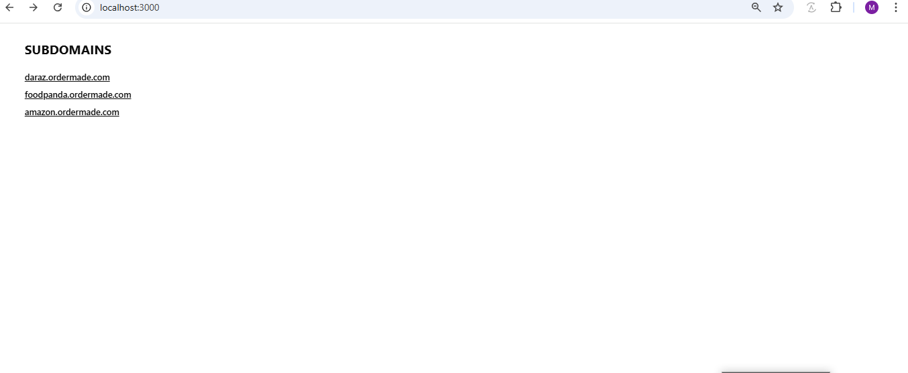
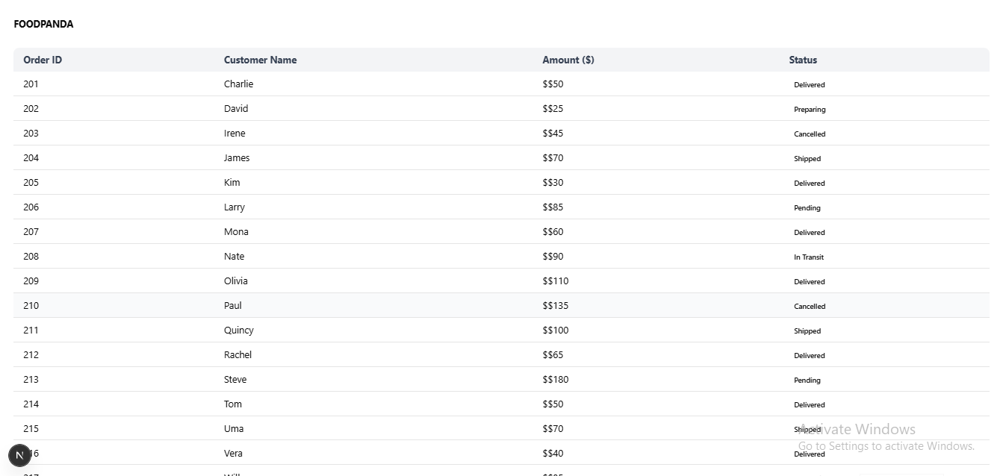
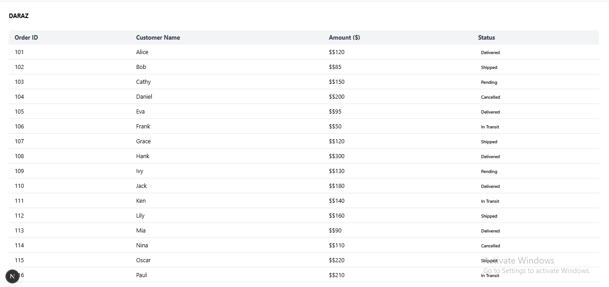
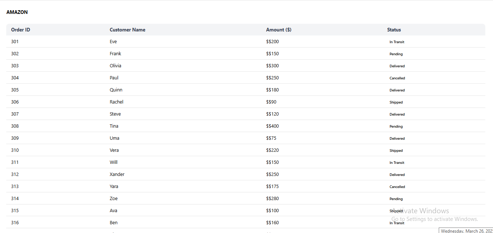

# barq-asessment

## Tech Stack

*   **Framework:** Next.js v15.2.4
*   **React:** v19.0.0
*   **State Management:** Zustand v5.0.3
*   **Styling:** Tailwind CSS v4
*   **Other Dependencies:** class-variance-authority, clsx, lucide-react, tailwind-merge, tw-animate-css

## How to Run This Project

1.  **Install Dependencies:**

    ```bash
    npm install
    ```

2.  **Run the Development Server:**

    ```bash
    npm run dev
    ```

    This will start the development server. Open your browser and navigate to `http://localhost:3000` to view the application.

## Available Scripts

*   `dev`: Runs the Next.js development server.
*   `build`: Builds the application for production.
*   `start`: Starts the Next.js production server.
*   `lint`: Runs the ESLint linter.
